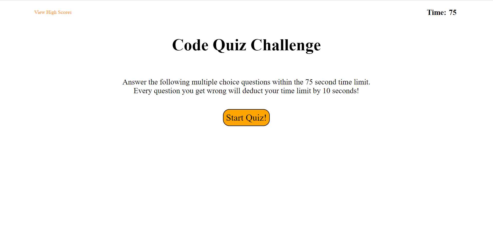

# jareds-code-quiz-challenge

## Description

This application is a code quiz made from scratch. I used HTML, CSS, and JavaScript to build this application. The main focus was around JavaScript to create functions and if statements to build the functionality of the quiz. When user clicks the start button, the quiz starts. When a question is answered, the next question pops up and text pops up saying whether you answered correct or not. When all questions are answered or the time limit runs out, your score will be shown and you can enter your initials to keep score.

## Installation

n/a

## Usage

  
**Deploy application:** https://jkim011.github.io/jareds-code-quiz-challenge/